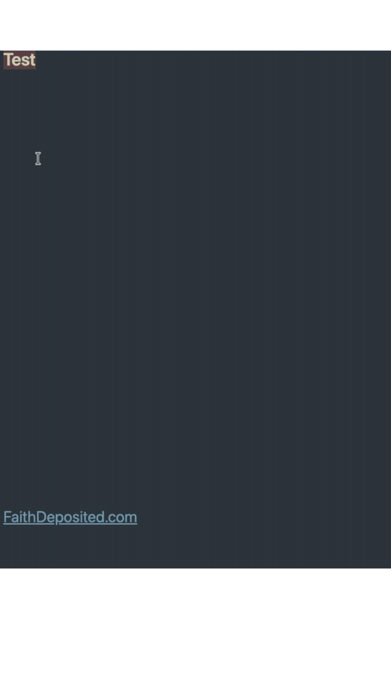

# Biblion

Biblion turns Bible verse references into verse text directly in your Obsidian note.

## Usage

Type `;;`, then a Bible reference, then press Enter.

For example, type this on its own line:

```text
;;John 3:16
```

Biblion replaces it with:

```markdown
> For God so loved the world, as to give his only begotten Son: that whosoever believeth in him may not perish, but may have life everlasting.
>
> -- John 3:16 (DRB)
```



More examples:

```text
;;Romans 8:38-39
;;John 3:16-4:2
```

Ranges can stay within one chapter, such as `;;Romans 8:38-39`, or cross chapters, such as `;;John 3:16-4:2`.

You can also run `Biblion: Expand Bible reference on current line` from the command palette.

## Q&A

### Which Bible translation does Biblion use?

Biblion uses the public-domain Douay-Rheims text from the GetBible `douayrheims` module.

### Does it support books like Tobit, Sirach, and Maccabees?

Yes. Biblion bundles 73 books, including the deuterocanonical books.

### Can I type older book names?

Yes. Older Douay-style names such as `1 Machabees`, `Ecclesiasticus`, and `Apocalypse` are accepted as aliases, but expanded references use modern book names.
